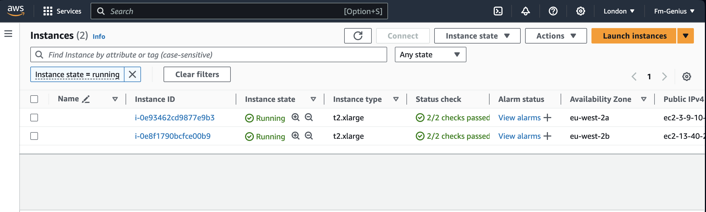

# AltSchool Africa School of Cloud Engineering Capstone Project

### Overview:

A microservices-based architecture application is deployed on Kubernetes and there’s a need to create a clear IaaC (Infrastructure as Code) deployment to be able to deploy the services in a fast manner.

### Setup Details:

Provision the Socks Shop example microservice application – https://microservices-demo.github.io/

### Task Instructions:

● Everything needs to be deployed using an Infrastructure as Code approach.

● In your solution please emphasize readability, maintainability, and DevOps

● We expect a clear way to recreate your setup and will evaluate the project decisions based on:

– Deploy pipeline
– Metrics
– Monitoring
– Logging

● Use Prometheus as a monitoring tool

● Use Ansible or Terraform as the configuration management tool.

● You can use an IaaS provider of your choice.

● The application should run on Kubernetes

================================================================

### Step 1:

I created a bash script called "Installer.sh" which comprises of updating packages, installation of terraform, kubernetes, aws cli, helm and jenkins.

### Step 2:

After Installing jenkins, i used jenkins to deploy the EKS cluster with the "cluster-jenskins" file. And Also, deploying the kubernetes pods with the "jenkins" file.

Kindly find the screenshots below.

 

 

 

 

 

 

 

 

